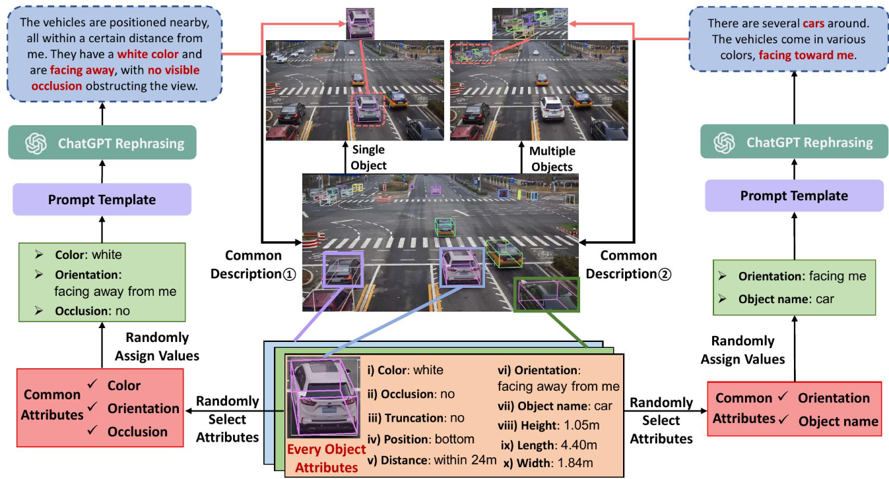

# VLMOD: Understanding Multi-Object World from Monocular View

Author: Keyu Guo, Yongle Hunag, Shijie Sun, Xiangyu Song, Mingtao Feng, Zedong Liu, Huansheng Song, Tiantian Wang, Jianxin Li, Naveed Akhtar and Ajmal Saeed Mian


The paper has been accepted by ***\*2025 IEEE Conference on Computer Vision and Pattern Recognition (CVPR2025)\**** 🎉.

<p align="center">

    This repository provides **partial code** for the **VLMOD Challenge (Track B)** — *Understanding Multi-Object World from Monocular View*.  





The task focuses on **multi-object 3D Visual Grounding (3DVG)** based on **a single monocular RGB image**, enabling machines to interpret complex scenes and spatial relationships using natural language.


## 🧠 Task Description
Given a monocular RGB image and a complex language description (e.g., *"find the red cup on the left side of the table and the black keyboard on the right side"*),  
the goal is to predict **each referred object’s**:
- 3D position (x, y, z)
- 3D size (width, height, depth)
- Orientation (rotation angle)

## 🚧 Core Challenges
- Multi-object scene parsing  
- Spatial relationship modeling  
- Accurate 3D property estimation  

## 📂 Code Release
We have **open-sourced part of our implementation** to help the community explore and reproduce results.  
You are encouraged to:

- Reproduce and verify the released modules  
- Implement or improve other components  
- Contribute new ideas for monocular 3D visual grounding  

## 🤝 Contribution
We welcome open discussions, reproduction efforts, and performance comparisons.  
Please feel free to submit issues or pull requests to share your work.

## 📜 License
This project is released for **academic and research purposes** only.


## **🏷️ Citation**

```bibtex
@inproceedings{guo2025beyond,
  title={Beyond Human Perception: Understanding Multi-Object World from Monocular View},
  author={Guo, Keyu and Huang, Yongle and Sun, Shijie and Song, Xiangyu and Feng, Mingtao and Liu, Zedong and Song, Huansheng and Wang, Tiantian and Li, Jianxin and Akhtar, Naveed and others},
  booktitle={Proceedings of the Computer Vision and Pattern Recognition Conference},
  pages={3751--3760},
  year={2025}
}
```


```
MonoMulti-3DVG
├─ analyze_train.py
├─ data
│  └─ test
│     ├─ 145040_fa2sd4a06W152AIR_420_1626155124_1626155723_128_obstacle.json
│     ├─ 145040_fa2sd4a06W152AIR_420_1626155124_1626155723_221_obstacle.json
│     ├─ 145040_fa2sd4a06W152AIR_420_1626155124_1626155723_60_obstacle.json
│     ├─ 145044_fa2sd4a06W152AIR_420_1626155724_1626155908_243_obstacle.json
│     ├─ 145044_fa2sd4a06W152AIR_420_1626155724_1626155908_31_obstacle.json
│     ├─ 145045_fa2sd4a06W152AIR_420_1626155908_1626156703_261_obstacle.json
│     ├─ 145046_fa2sd4a06W152AIR_420_1626156703_1626157310_223_obstacle.json
│     ├─ 145047_fa2sd4a08E154AIR_420_1626239765_1626240189_182_obstacle.json
│     ├─ 145047_fa2sd4a08E154AIR_420_1626239765_1626240189_263_obstacle.json
│     ├─ 145048_fa2sd4a08E154AIR_420_1626240189_1626240424_230_obstacle.json
│     ├─ 145048_fa2sd4a08E154AIR_420_1626240189_1626240424_4_obstacle.json
│     ├─ 145050_fa2sd4a09S151AIR_420_1626164593_1626164733_104_obstacle.json
│     ├─ 145050_fa2sd4a09S151AIR_420_1626164593_1626164733_197_obstacle.json
│     ├─ 145050_fa2sd4a09S151AIR_420_1626164593_1626164733_24_obstacle.json
│     ├─ 145050_fa2sd4a09S151AIR_420_1626164593_1626164733_259_obstacle.json
│     ├─ 145052_fa2sd4a09S151AIR_420_1626164733_1626165003_203_obstacle.json
│     ├─ 145053_fa2sd4a09S151AIR_420_1626165406_1626165535_167_obstacle.json
│     ├─ 145053_fa2sd4a09S151AIR_420_1626165406_1626165535_56_obstacle.json
│     ├─ 145054_fa2sd4a09S151AIR_420_1626165535_1626165806_151_obstacle.json
│     ├─ 145054_fa2sd4a09S151AIR_420_1626165535_1626165806_65_obstacle.json
│     ├─ 145054_fa2sd4a09S151AIR_420_1626165535_1626165806_86_obstacle.json
│     ├─ 145055_fa2sd4a09S151AIR_420_1626165806_1626166384_262_obstacle.json
│     ├─ 145056_fa2sd4a09S151AIR_420_1626166810_1626167049_114_obstacle.json
│     ├─ 145056_fa2sd4a09S151AIR_420_1626166810_1626167049_200_obstacle.json
│     ├─ 145056_fa2sd4a09S151AIR_420_1626166810_1626167049_22_obstacle.json
│     ├─ 145056_fa2sd4a09S151AIR_420_1626166810_1626167049_292_obstacle.json
│     ├─ 145056_fa2sd4a09S151AIR_420_1626166810_1626167049_65_obstacle.json
│     ├─ 145056_fa2sd4a09S151AIR_420_1626166810_1626167049_6_obstacle.json
│     ├─ 145056_fa2sd4a09S151AIR_420_1626166810_1626167049_7_obstacle.json
│     ├─ 145057_fa2sd4a09S151AIR_420_1626166384_1626166810_191_obstacle.json
│     ├─ 145057_fa2sd4a09S151AIR_420_1626166384_1626166810_215_obstacle.json
│     ├─ 145058_fa2sd4a09S151AIR_420_1626167049_1626167205_111_obstacle.json
│     ├─ 145058_fa2sd4a09S151AIR_420_1626167049_1626167205_145_obstacle.json
│     ├─ 145058_fa2sd4a09S151AIR_420_1626167049_1626167205_94_obstacle.json
│     ├─ 145409_fa2sd4a10W152AIR_420_1626159838_1626160089_195_obstacle.json
│     ├─ 145409_fa2sd4a10W152AIR_420_1626159838_1626160089_23_obstacle.json
│     ├─ 145409_fa2sd4a10W152AIR_420_1626159838_1626160089_43_obstacle.json
│     ├─ 145409_fa2sd4a10W152AIR_420_1626159838_1626160089_93_obstacle.json
│     ├─ 145410_fa2sd4a10W152AIR_420_1626160533_1626160712_130_obstacle.json
│     ├─ 145410_fa2sd4a10W152AIR_420_1626160533_1626160712_195_obstacle.json
│     ├─ 145410_fa2sd4a10W152AIR_420_1626160533_1626160712_197_obstacle.json
│     ├─ 145410_fa2sd4a10W152AIR_420_1626160533_1626160712_216_obstacle.json
│     ├─ 145411_fa2sd4a10W152AIR_420_1626160257_1626160533_250_obstacle.json
│     ├─ 145412_fa2sd4a10W152AIR_420_1626160712_1626161037_150_obstacle.json
│     ├─ 145412_fa2sd4a10W152AIR_420_1626160712_1626161037_207_obstacle.json
│     ├─ 145412_fa2sd4a10W152AIR_420_1626160712_1626161037_235_obstacle.json
│     ├─ 145412_fa2sd4a10W152AIR_420_1626160712_1626161037_62_obstacle.json
│     ├─ 145413_fa2sd4a10W152AIR_420_1626160089_1626160257_265_obstacle.json
│     ├─ 145413_fa2sd4a10W152AIR_420_1626160089_1626160257_84_obstacle.json
│     ├─ 145414_fa2sd4a10W152AIR_420_1626161301_1626161686_69_obstacle.json
│     ├─ 145415_fa2sd4a10W152AIR_420_1626161960_1626162131_187_obstacle.json
│     ├─ 145415_fa2sd4a10W152AIR_420_1626161960_1626162131_215_obstacle.json
│     ├─ 145415_fa2sd4a10W152AIR_420_1626161960_1626162131_234_obstacle.json
│     ├─ 145415_fa2sd4a10W152AIR_420_1626161960_1626162131_32_obstacle.json
│     ├─ 145416_fa2sd4a10W152AIR_420_1626161686_1626161960_185_obstacle.json
│     ├─ 145416_fa2sd4a10W152AIR_420_1626161686_1626161960_1_obstacle.json
│     ├─ 145416_fa2sd4a10W152AIR_420_1626161686_1626161960_255_obstacle.json
│     ├─ 145416_fa2sd4a10W152AIR_420_1626161686_1626161960_279_obstacle.json
│     ├─ 145417_fa2sd4a10W152AIR_420_1626161037_1626161300_196_obstacle.json
│     ├─ 145417_fa2sd4a10W152AIR_420_1626161037_1626161300_26_obstacle.json
│     ├─ 145417_fa2sd4a10W152AIR_420_1626161037_1626161300_280_obstacle.json
│     ├─ 145419_fa2sd4a13W152AIR_420_1626245482_1626246966_140_obstacle.json
│     ├─ 145419_fa2sd4a13W152AIR_420_1626245482_1626246966_282_obstacle.json
│     ├─ 145419_fa2sd4a13W152AIR_420_1626245482_1626246966_37_obstacle.json
│     ├─ 145420_fa2sd4a13W152AIR_420_1626245124_1626245482_145_obstacle.json
│     ├─ 145420_fa2sd4a13W152AIR_420_1626245124_1626245482_156_obstacle.json
│     ├─ 145420_fa2sd4a13W152AIR_420_1626245124_1626245482_180_obstacle.json
│     ├─ 145420_fa2sd4a13W152AIR_420_1626245124_1626245482_52_obstacle.json
│     ├─ 1632_fa2sd4a11North151_420_1613716796_1613719782_123_obstacle.json
│     ├─ 1632_fa2sd4a11North151_420_1613716796_1613719782_162_obstacle.json
│     ├─ 1632_fa2sd4a11North151_420_1613719792_1613722259_136_obstacle.json
│     ├─ 1632_fa2sd4a11North151_420_1613724070_1613731267_158_obstacle.json
│     ├─ 1632_fa2sd4a11North151_420_1613724070_1613731267_98_obstacle.json
│     ├─ 1632_fa2sd4a11South153_420_1613710844_1613716677_4_obstacle.json
│     ├─ 1632_fa2sd4a11South153_420_1613719682_1613722256_247_obstacle.json
│     ├─ 1632_fa2sd4a11South153_420_1613724054_1613731268_175_obstacle.json
│     ├─ 1632_fa2sd4a11South153_420_1613724054_1613731268_201_obstacle.json
│     ├─ 1679_fa2sd4adatasetNorth151_420_1616052344_1616052648_133_obstacle.json
│     ├─ 1679_fa2sd4adatasetNorth151_420_1616052954_1616053259_129_obstacle.json
│     ├─ 1679_fa2sd4adatasetNorth151_420_1616052954_1616053259_266_obstacle.json
│     ├─ 1679_fa2sd4adatasetNorth151_420_1616052954_1616053259_286_obstacle.json
│     ├─ 1679_fa2sd4adatasetNorth151_420_1616053261_1616053566_110_obstacle.json
│     ├─ 1679_fa2sd4adatasetNorth151_420_1616053261_1616053566_140_obstacle.json
│     ├─ 1679_fa2sd4adatasetNorth151_420_1616053261_1616053566_205_obstacle.json
│     ├─ 1679_fa2sd4adatasetNorth151_420_1616053261_1616053566_225_obstacle.json
│     ├─ 1679_fa2sd4adatasetNorth151_420_1616053261_1616053566_36_obstacle.json
│     ├─ 1679_fa2sd4adatasetNorth151_420_1616053261_1616053566_85_obstacle.json
│     ├─ 1679_fa2sd4adatasetNorth151_420_1616053567_1616053872_116_obstacle.json
│     ├─ 1679_fa2sd4adatasetNorth151_420_1616053567_1616053872_190_obstacle.json
│     ├─ 1679_fa2sd4adatasetNorth151_420_1616053567_1616053872_214_obstacle.json
│     ├─ 1679_fa2sd4adatasetNorth151_420_1616053567_1616053872_262_obstacle.json
│     ├─ 1679_fa2sd4adatasetNorth151_420_1616053873_1616054177_215_obstacle.json
│     ├─ 1679_fa2sd4adatasetNorth151_420_1616054483_1616054787_125_obstacle.json
│     ├─ 1679_fa2sd4adatasetNorth151_420_1616054788_1616055093_219_obstacle.json
│     ├─ 1679_fa2sd4adatasetNorth151_420_1616054788_1616055093_8_obstacle.json
│     ├─ 1679_fa2sd4adatasetNorth151_420_1616055094_1616055397_47_obstacle.json
│     ├─ 1679_fa2sd4adatasetNorth151_420_1616055094_1616055397_7_obstacle.json
│     ├─ 1679_fa2sd4adatasetNorth151_420_1616055094_1616055397_81_obstacle.json
│     ├─ 1679_fa2sd4adatasetNorth151_420_1616055398_1616055702_134_obstacle.json
│     ├─ 1679_fa2sd4adatasetNorth151_420_1616055398_1616055702_154_obstacle.json
│     ├─ 1679_fa2sd4adatasetNorth151_420_1616055703_1616056008_260_obstacle.json
│     ├─ 1679_fa2sd4adatasetNorth151_420_1616055703_1616056008_265_obstacle.json
│     ├─ 1679_fa2sd4adatasetNorth151_420_1616056009_1616056314_142_obstacle.json
│     ├─ 1679_fa2sd4adatasetNorth151_420_1616056009_1616056314_66_obstacle.json
│     ├─ 1679_fa2sd4adatasetNorth151_420_1616056623_1616056927_12_obstacle.json
│     ├─ 1679_fa2sd4adatasetNorth151_420_1616056623_1616056927_35_obstacle.json
│     ├─ 1679_fa2sd4adatasetNorth151_420_1616056623_1616056927_83_obstacle.json
│     ├─ 1679_fa2sd4adatasetNorth151_420_1616056928_1616057233_123_obstacle.json
│     ├─ 1679_fa2sd4adatasetNorth151_420_1616056928_1616057233_216_obstacle.json
│     ├─ 1679_fa2sd4adatasetNorth151_420_1616056928_1616057233_24_obstacle.json
│     ├─ 1679_fa2sd4adatasetNorth151_420_1616056928_1616057233_26_obstacle.json
│     ├─ 1679_fa2sd4adatasetNorth151_420_1616057234_1616057538_160_obstacle.json
│     ├─ 1679_fa2sd4adatasetNorth151_420_1616057234_1616057538_240_obstacle.json
│     ├─ 1679_fa2sd4adatasetNorth151_420_1616057234_1616057538_270_obstacle.json
│     ├─ 1679_fa2sd4adatasetNorth151_420_1616057234_1616057538_289_obstacle.json
│     ├─ 1679_fa2sd4adatasetNorth151_420_1616057234_1616057538_54_obstacle.json
│     ├─ 1679_fa2sd4adatasetNorth151_420_1616057234_1616057538_57_obstacle.json
│     ├─ 1784_fa2sd4adatasetWest152_420_1621242987_1621243138_170_obstacle.json
│     ├─ 1784_fa2sd4adatasetWest152_420_1621242987_1621243138_270_obstacle.json
│     ├─ 1784_fa2sd4adatasetWest152_420_1621243139_1621243290_149_obstacle.json
│     ├─ 1784_fa2sd4adatasetWest152_420_1621243139_1621243290_208_obstacle.json
│     ├─ 1784_fa2sd4adatasetWest152_420_1621243139_1621243290_209_obstacle.json
│     ├─ 1784_fa2sd4adatasetWest152_420_1621243139_1621243290_25_obstacle.json
│     ├─ 1784_fa2sd4adatasetWest152_420_1621243291_1621243443_111_obstacle.json
│     ├─ 1784_fa2sd4adatasetWest152_420_1621243291_1621243443_114_obstacle.json
│     ├─ 1784_fa2sd4adatasetWest152_420_1621243291_1621243443_246_obstacle.json
│     ├─ 1784_fa2sd4adatasetWest152_420_1621243291_1621243443_68_obstacle.json
│     ├─ 1784_fa2sd4adatasetWest152_420_1621243444_1621243597_139_obstacle.json
│     ├─ 1784_fa2sd4adatasetWest152_420_1621243444_1621243597_208_obstacle.json
│     ├─ 1784_fa2sd4adatasetWest152_420_1621243444_1621243597_27_obstacle.json
│     ├─ 1784_fa2sd4adatasetWest152_420_1621243598_1621243749_119_obstacle.json
│     ├─ 1784_fa2sd4adatasetWest152_420_1621243598_1621243749_193_obstacle.json
│     ├─ 1784_fa2sd4adatasetWest152_420_1621243598_1621243749_197_obstacle.json
│     ├─ 1784_fa2sd4adatasetWest152_420_1621243598_1621243749_25_obstacle.json
│     ├─ 1784_fa2sd4adatasetWest152_420_1621243598_1621243749_293_obstacle.json
│     ├─ 1784_fa2sd4adatasetWest152_420_1621243598_1621243749_63_obstacle.json
│     ├─ 1784_fa2sd4adatasetWest152_420_1621243598_1621243749_94_obstacle.json
│     ├─ 1784_fa2sd4adatasetWest152_420_1621243750_1621243900_180_obstacle.json
│     ├─ 1784_fa2sd4adatasetWest152_420_1621243750_1621243900_258_obstacle.json
│     ├─ 1784_fa2sd4adatasetWest152_420_1621244053_1621244206_261_obstacle.json
│     ├─ 1784_fa2sd4adatasetWest152_420_1621244207_1621244359_123_obstacle.json
│     ├─ 1784_fa2sd4adatasetWest152_420_1621244207_1621244359_184_obstacle.json
│     ├─ 1784_fa2sd4adatasetWest152_420_1621244207_1621244359_216_obstacle.json
│     ├─ 1784_fa2sd4adatasetWest152_420_1621244207_1621244359_232_obstacle.json
│     ├─ 1784_fa2sd4adatasetWest152_420_1621244207_1621244359_249_obstacle.json
│     ├─ 1784_fa2sd4adatasetWest152_420_1621244207_1621244359_254_obstacle.json
│     ├─ 1784_fa2sd4adatasetWest152_420_1621244207_1621244359_82_obstacle.json
│     ├─ 1784_fa2sd4adatasetWest152_420_1621244359_1621244510_100_obstacle.json
│     ├─ 1784_fa2sd4adatasetWest152_420_1621244359_1621244510_117_obstacle.json
│     ├─ 1784_fa2sd4adatasetWest152_420_1621244359_1621244510_20_obstacle.json
│     ├─ 1784_fa2sd4adatasetWest152_420_1621244510_1621244663_253_obstacle.json
│     ├─ 1784_fa2sd4adatasetWest152_420_1621244663_1621244813_168_obstacle.json
│     ├─ 1784_fa2sd4adatasetWest152_420_1621244663_1621244813_174_obstacle.json
│     ├─ 1784_fa2sd4adatasetWest152_420_1621244663_1621244813_175_obstacle.json
│     ├─ 1784_fa2sd4adatasetWest152_420_1621244663_1621244813_190_obstacle.json
│     ├─ 1784_fa2sd4adatasetWest152_420_1621244814_1621244965_78_obstacle.json
│     ├─ 1784_fa2sd4adatasetWest152_420_1621244966_1621245117_42_obstacle.json
│     ├─ 1784_fa2sd4adatasetWest152_420_1621245117_1621245268_22_obstacle.json
│     ├─ 1784_fa2sd4adatasetWest152_420_1621245117_1621245268_243_obstacle.json
│     ├─ 1784_fa2sd4adatasetWest152_420_1621245269_1621245419_129_obstacle.json
│     ├─ 1784_fa2sd4adatasetWest152_420_1621245269_1621245419_252_obstacle.json
│     ├─ 1784_fa2sd4adatasetWest152_420_1621245571_1621245723_247_obstacle.json
│     ├─ 1784_fa2sd4adatasetWest152_420_1621245723_1621245873_202_obstacle.json
│     ├─ 1784_fa2sd4adatasetWest152_420_1621245723_1621245873_35_obstacle.json
│     ├─ 1784_fa2sd4adatasetWest152_420_1621245723_1621245873_59_obstacle.json
│     ├─ 1784_fa2sd4adatasetWest152_420_1621245723_1621245873_90_obstacle.json
│     ├─ 1784_fa2sd4adatasetWest152_420_1621245873_1621246024_152_obstacle.json
│     ├─ 1784_fa2sd4adatasetWest152_420_1621245873_1621246024_206_obstacle.json
│     ├─ 1784_fa2sd4adatasetWest152_420_1621246025_1621246175_83_obstacle.json
│     ├─ 1784_fa2sd4adatasetWest152_420_1621246025_1621246175_85_obstacle.json
│     ├─ 1784_fa2sd4adatasetWest152_420_1621246328_1621246478_227_obstacle.json
│     ├─ 1784_fa2sd4adatasetWest152_420_1621246478_1621246629_257_obstacle.json
│     ├─ 1784_fa2sd4adatasetWest152_420_1621246478_1621246629_89_obstacle.json
│     ├─ 1784_fa2sd4adatasetWest152_420_1621246630_1621246780_157_obstacle.json
│     ├─ 1784_fa2sd4adatasetWest152_420_1621246630_1621246780_192_obstacle.json
│     ├─ 1784_fa2sd4adatasetWest152_420_1621246630_1621246780_193_obstacle.json
│     ├─ 1784_fa2sd4adatasetWest152_420_1621246781_1621246931_132_obstacle.json
│     ├─ 1784_fa2sd4adatasetWest152_420_1621247082_1621247234_14_obstacle.json
│     ├─ 1784_fa2sd4adatasetWest152_420_1621247082_1621247234_193_obstacle.json
│     ├─ 1784_fa2sd4adatasetWest152_420_1621247234_1621247385_166_obstacle.json
│     ├─ 1784_fa2sd4adatasetWest152_420_1621247385_1621247537_124_obstacle.json
│     ├─ 1784_fa2sd4adatasetWest152_420_1621247385_1621247537_131_obstacle.json
│     ├─ 1784_fa2sd4adatasetWest152_420_1621247385_1621247537_200_obstacle.json
│     ├─ 1784_fa2sd4adatasetWest152_420_1621247385_1621247537_266_obstacle.json
│     ├─ 1784_fa2sd4adatasetWest152_420_1621247688_1621247839_11_obstacle.json
│     ├─ 1784_fa2sd4adatasetWest152_420_1621247688_1621247839_41_obstacle.json
│     ├─ 1784_fa2sd4adatasetWest152_420_1621247688_1621247839_89_obstacle.json
│     ├─ 1784_fa2sd4adatasetWest152_420_1621247839_1621247990_85_obstacle.json
│     ├─ 1784_fa2sd4adatasetWest152_420_1621247990_1621248044_24_obstacle.json
│     ├─ 1784_fa2sd4adatasetWest152_420_1621247990_1621248044_39_obstacle.json
│     ├─ 1784_fa2sd4adatasetWest152_420_1621247990_1621248044_64_obstacle.json
│     ├─ 1784_fa2sd4adatasetWest152_420_1621247990_1621248044_68_obstacle.json
│     ├─ 1901_fa2sd4adatasetf328h9k14camera151_420_1629885933_1629886230_177_obstacle.json
│     ├─ 1901_fa2sd4adatasetf328h9k14camera151_420_1629885933_1629886230_57_obstacle.json
│     ├─ 1901_fa2sd4adatasetf328h9k14camera151_420_1629886529_1629886828_191_obstacle.json
│     ├─ 1901_fa2sd4adatasetf328h9k14camera151_420_1629886829_1629887126_254_obstacle.json
│     ├─ 1901_fa2sd4adatasetf328h9k14camera151_420_1629887127_1629887422_234_obstacle.json
│     ├─ 1901_fa2sd4adatasetf328h9k14camera151_420_1629887127_1629887422_249_obstacle.json
│     ├─ 1901_fa2sd4adatasetf328h9k14camera151_420_1629887423_1629887719_112_obstacle.json
│     ├─ 1901_fa2sd4adatasetf328h9k14camera151_420_1629887423_1629887719_115_obstacle.json
│     ├─ 1901_fa2sd4adatasetf328h9k14camera151_420_1629887423_1629887719_25_obstacle.json
│     ├─ 1901_fa2sd4adatasetf328h9k14camera151_420_1629887423_1629887719_51_obstacle.json
│     ├─ 1901_fa2sd4adatasetf328h9k14camera151_420_1629888019_1629888320_230_obstacle.json
│     ├─ 1901_fa2sd4adatasetf328h9k14camera151_420_1629888019_1629888320_281_obstacle.json
│     ├─ 1901_fa2sd4adatasetsj8fas14151_420_1629885634_1629885932_280_obstacle.json
│     ├─ 1901_fa2sd4adatasetsj8fas17151_420_1629892099_1629893096_209_obstacle.json
│     ├─ 1901_fa2sd4adatasetsj8fas17151_420_1629892099_1629893096_24_obstacle.json
│     ├─ 1901_fa2sd4adatasetsj8fas17151_420_1629893099_1629894100_105_obstacle.json
│     ├─ 1901_fa2sd4adatasetsj8fas17151_420_1629893099_1629894100_107_obstacle.json
│     ├─ 1901_fa2sd4adatasetsj8fas17151_420_1629893099_1629894100_136_obstacle.json
│     ├─ 1901_fa2sd4adatasetsj8fas17151_420_1629893099_1629894100_159_obstacle.json
│     ├─ 1901_fa2sd4adatasetsj8fas17151_420_1629893099_1629894100_163_obstacle.json
│     ├─ 1901_fa2sd4adatasetsj8fas17151_420_1629893099_1629894100_195_obstacle.json
│     ├─ 1901_fa2sd4adatasetsj8fas17151_420_1629894103_1629895097_195_obstacle.json
│     ├─ 1901_fa2sd4adatasetsj8fas17151_420_1629894103_1629895097_89_obstacle.json
│     ├─ 1901_fa2sd4adatasetsj8fas17151_420_1629895100_1629896097_2_obstacle.json
│     ├─ 1901_fa2sd4adatasetsj8fas17151_420_1629896101_1629897097_154_obstacle.json
│     ├─ 1901_fa2sd4adatasetsj8fas17151_420_1629897100_1629898100_165_obstacle.json
│     ├─ 1901_fa2sd4adatasetsj8fas23152_420_1629921602_1629923098_204_obstacle.json
│     ├─ 1901_fa2sd4adatasetsj8fas23152_420_1629921602_1629923098_61_obstacle.json
│     ├─ 1901_fa2sd4adatasetsj8fas23152_420_1629923103_1629924598_8_obstacle.json
│     ├─ 1901_fa2sd4adatasetsj8fas23152_420_1629924603_1629926099_30_obstacle.json
│     ├─ 1901_fa2sd4adatasetsj8fas23152_420_1629924603_1629926099_4_obstacle.json
│     ├─ 1901_fa2sd4adatasetsj8fas23152_420_1629926104_1629927604_177_obstacle.json
│     ├─ 1901_fa2sd4adatasetsj8fas23152_420_1629927609_1629929146_136_obstacle.json
│     ├─ 1901_fa2sd4adatasetsj8fas23152_420_1629927609_1629929146_16_obstacle.json
│     ├─ 1901_fa2sd4adatasetsj8fas23152_420_1629927609_1629929146_97_obstacle.json
│     ├─ 1901_fa2sd4adatasetsj8fas23152_420_1629929151_1629930647_129_obstacle.json
│     ├─ 1901_fa2sd4adatasetsj8fas23152_420_1629929151_1629930647_58_obstacle.json
│     ├─ 1901_fa2sd4adatasetsj8fas23152_420_1629930652_1629932149_125_obstacle.json
│     ├─ 61831_fa2sd4a2West152_420_1625824638_1625825007_124_obstacle.json
│     ├─ 61831_fa2sd4a2West152_420_1625824638_1625825007_147_obstacle.json
│     ├─ 61831_fa2sd4a2West152_420_1625824638_1625825007_264_obstacle.json
│     ├─ 61831_fa2sd4a2West152_420_1625824638_1625825007_81_obstacle.json
│     ├─ 61832_fa2sd4a2West152_420_1625823527_1625823896_59_obstacle.json
│     ├─ 61833_fa2sd4a2West152_420_1625823897_1625824266_56_obstacle.json
│     ├─ 61833_fa2sd4a2West152_420_1625823897_1625824266_87_obstacle.json
│     ├─ 61833_fa2sd4a2West152_420_1625823897_1625824266_9_obstacle.json
│     ├─ 62014_fa2sd4adatasetNorth151_420_1625825029_1625825278_196_obstacle.json
│     ├─ 62016_fa2sd4adatasetNorth151_420_1625823527_1625823904_168_obstacle.json
│     ├─ 62017_fa2sd4adatasetNorth151_420_1625823905_1625824279_129_obstacle.json
│     ├─ 62018_fa2sd4adatasetNorth151_420_1625824281_1625824654_153_obstacle.json
│     ├─ 62018_fa2sd4adatasetNorth151_420_1625824281_1625824654_229_obstacle.json
│     ├─ 62018_fa2sd4adatasetNorth151_420_1625824281_1625824654_73_obstacle.json
│     ├─ 62453_fa2sd4adatasetSouth151_420_1625822986_1625823745_175_obstacle.json
│     ├─ 62453_fa2sd4adatasetSouth151_420_1625822986_1625823745_48_obstacle.json
│     ├─ 62453_fa2sd4adatasetSouth151_420_1625822986_1625823745_51_obstacle.json
│     ├─ 62454_fa2sd4adatasetSouth151_420_1625823749_1625824503_137_obstacle.json
│     ├─ 62455_fa2sd4adatasetSouth151_420_1625824507_1625825252_151_obstacle.json
│     ├─ 62455_fa2sd4adatasetSouth151_420_1625824507_1625825252_68_obstacle.json
│     ├─ 62512_fa2sd4a10East154_420_1625822987_1625823739_7_obstacle.json
│     ├─ 62516_fa2sd4a10East154_420_1625823740_1625824485_93_obstacle.json
│     ├─ 62517_fa2sd4a10East154_420_1625824486_1625825247_181_obstacle.json
│     ├─ 62517_fa2sd4a10East154_420_1625824486_1625825247_246_obstacle.json
│     ├─ 62517_fa2sd4a10East154_420_1625824486_1625825247_297_obstacle.json
│     ├─ 62517_fa2sd4a10East154_420_1625824486_1625825247_63_obstacle.json
│     ├─ 62518_fa2sd4a13North153_420_1625816692_1625817118_158_obstacle.json
│     ├─ 62518_fa2sd4a13North153_420_1625816692_1625817118_8_obstacle.json
│     ├─ 62518_fa2sd4a13North153_420_1625816692_1625817118_90_obstacle.json
│     ├─ 62531_fa2sd4a13East154_420_1625814455_1625815202_13_obstacle.json
│     ├─ 62531_fa2sd4a13East154_420_1625814455_1625815202_258_obstacle.json
│     ├─ 62531_fa2sd4a13East154_420_1625814455_1625815202_25_obstacle.json
│     ├─ 62531_fa2sd4a13East154_420_1625814455_1625815202_261_obstacle.json
│     ├─ 62531_fa2sd4a13East154_420_1625814455_1625815202_67_obstacle.json
│     ├─ 62533_fa2sd4a13East154_420_1625815958_1625816709_153_obstacle.json
│     ├─ 62533_fa2sd4a13East154_420_1625815958_1625816709_4_obstacle.json
│     ├─ 62533_fa2sd4a13East154_420_1625815958_1625816709_66_obstacle.json
│     ├─ 62535_fa2sd4a16North153_420_1625807368_1625808118_174_obstacle.json
│     ├─ 62535_fa2sd4a16North153_420_1625807368_1625808118_198_obstacle.json
│     ├─ 62535_fa2sd4a16North153_420_1625807368_1625808118_62_obstacle.json
│     ├─ 62536_fa2sd4a16North153_420_1625808119_1625808869_151_obstacle.json
│     ├─ 62536_fa2sd4a16North153_420_1625808119_1625808869_189_obstacle.json
│     ├─ 62536_fa2sd4a16North153_420_1625808119_1625808869_30_obstacle.json
│     ├─ 62537_fa2sd4a16North153_420_1625808873_1625809618_106_obstacle.json
│     ├─ 62537_fa2sd4a16North153_420_1625808873_1625809618_67_obstacle.json
│     ├─ 62537_fa2sd4a16North153_420_1625808873_1625809618_8_obstacle.json
│     ├─ 62539_fa2sd4a16East154_420_1625807364_1625808113_174_obstacle.json
│     ├─ 62539_fa2sd4a16East154_420_1625807364_1625808113_296_obstacle.json
│     ├─ 62539_fa2sd4a16East154_420_1625807364_1625808113_298_obstacle.json
│     ├─ 62540_fa2sd4a16East154_420_1625808117_1625808861_167_obstacle.json
│     ├─ 62540_fa2sd4a16East154_420_1625808117_1625808861_235_obstacle.json
│     ├─ 62541_fa2sd4a16East154_420_1625808865_1625809623_275_obstacle.json
│     ├─ 62541_fa2sd4a16East154_420_1625808865_1625809623_73_obstacle.json
│     ├─ 67980_fa2sd4adatasetfa2sd4a09151_420_1626164333_1626164784_124_obstacle.json
│     ├─ 67980_fa2sd4adatasetfa2sd4a09151_420_1626164333_1626164784_130_obstacle.json
│     ├─ 67980_fa2sd4adatasetfa2sd4a09151_420_1626164333_1626164784_64_obstacle.json
│     ├─ 67980_fa2sd4adatasetfa2sd4a09151_420_1626164333_1626164784_73_obstacle.json
│     ├─ 67991_fa2sd4adatasetfa2sd4a09151_420_1626164785_1626165235_101_obstacle.json
│     ├─ 67991_fa2sd4adatasetfa2sd4a09151_420_1626164785_1626165235_10_obstacle.json
│     ├─ 67991_fa2sd4adatasetfa2sd4a09151_420_1626164785_1626165235_65_obstacle.json
│     ├─ 67991_fa2sd4adatasetfa2sd4a09151_420_1626164785_1626165235_6_obstacle.json
│     ├─ 67992_fa2sd4adatasetfa2sd4a09151_420_1626165236_1626165684_122_obstacle.json
│     ├─ 67992_fa2sd4adatasetfa2sd4a09151_420_1626165236_1626165684_215_obstacle.json
│     ├─ 67993_fa2sd4adatasetfa2sd4a09151_420_1626165686_1626166134_176_obstacle.json
│     ├─ 67993_fa2sd4adatasetfa2sd4a09151_420_1626165686_1626166134_1_obstacle.json
│     ├─ 67993_fa2sd4adatasetfa2sd4a09151_420_1626165686_1626166134_271_obstacle.json
│     ├─ 67993_fa2sd4adatasetfa2sd4a09151_420_1626165686_1626166134_35_obstacle.json
│     ├─ 67994_fa2sd4adatasetfa2sd4a09151_420_1626166135_1626166584_222_obstacle.json
│     ├─ 67994_fa2sd4adatasetfa2sd4a09151_420_1626166135_1626166584_86_obstacle.json
│     ├─ 67995_fa2sd4adatasetfa2sd4a09151_420_1626167038_1626167399_218_obstacle.json
│     └─ MonoMulti3D
│        └─ test
│           ├─ 145040_fa2sd4a06W152AIR_420_1626155124_1626155723_128_obstacle.json
│           ├─ 145040_fa2sd4a06W152AIR_420_1626155124_1626155723_221_obstacle.json
│           ├─ 145040_fa2sd4a06W152AIR_420_1626155124_1626155723_60_obstacle.json
│           ├─ 145044_fa2sd4a06W152AIR_420_1626155724_1626155908_243_obstacle.json
│           ├─ 145044_fa2sd4a06W152AIR_420_1626155724_1626155908_31_obstacle.json
│           ├─ 145045_fa2sd4a06W152AIR_420_1626155908_1626156703_261_obstacle.json
│           ├─ 145046_fa2sd4a06W152AIR_420_1626156703_1626157310_223_obstacle.json
│           ├─ 145047_fa2sd4a08E154AIR_420_1626239765_1626240189_182_obstacle.json
│           ├─ 145047_fa2sd4a08E154AIR_420_1626239765_1626240189_263_obstacle.json
│           ├─ 145048_fa2sd4a08E154AIR_420_1626240189_1626240424_230_obstacle.json
│           ├─ 145048_fa2sd4a08E154AIR_420_1626240189_1626240424_4_obstacle.json
│           ├─ 145050_fa2sd4a09S151AIR_420_1626164593_1626164733_104_obstacle.json
│           ├─ 145050_fa2sd4a09S151AIR_420_1626164593_1626164733_197_obstacle.json
│           ├─ 145050_fa2sd4a09S151AIR_420_1626164593_1626164733_24_obstacle.json
│           ├─ 145050_fa2sd4a09S151AIR_420_1626164593_1626164733_259_obstacle.json
│           ├─ 145052_fa2sd4a09S151AIR_420_1626164733_1626165003_203_obstacle.json
│           ├─ 145053_fa2sd4a09S151AIR_420_1626165406_1626165535_167_obstacle.json
│           ├─ 145053_fa2sd4a09S151AIR_420_1626165406_1626165535_56_obstacle.json
│           ├─ 145054_fa2sd4a09S151AIR_420_1626165535_1626165806_151_obstacle.json
│           ├─ 145054_fa2sd4a09S151AIR_420_1626165535_1626165806_65_obstacle.json
│           ├─ 145054_fa2sd4a09S151AIR_420_1626165535_1626165806_86_obstacle.json
│           ├─ 145055_fa2sd4a09S151AIR_420_1626165806_1626166384_262_obstacle.json
│           ├─ 145056_fa2sd4a09S151AIR_420_1626166810_1626167049_114_obstacle.json
│           ├─ 145056_fa2sd4a09S151AIR_420_1626166810_1626167049_200_obstacle.json
│           ├─ 145056_fa2sd4a09S151AIR_420_1626166810_1626167049_22_obstacle.json
│           ├─ 145056_fa2sd4a09S151AIR_420_1626166810_1626167049_292_obstacle.json
│           ├─ 145056_fa2sd4a09S151AIR_420_1626166810_1626167049_65_obstacle.json
│           ├─ 145056_fa2sd4a09S151AIR_420_1626166810_1626167049_6_obstacle.json
│           ├─ 145056_fa2sd4a09S151AIR_420_1626166810_1626167049_7_obstacle.json
│           ├─ 145057_fa2sd4a09S151AIR_420_1626166384_1626166810_191_obstacle.json
│           ├─ 145057_fa2sd4a09S151AIR_420_1626166384_1626166810_215_obstacle.json
│           ├─ 145058_fa2sd4a09S151AIR_420_1626167049_1626167205_111_obstacle.json
│           ├─ 145058_fa2sd4a09S151AIR_420_1626167049_1626167205_145_obstacle.json
│           ├─ 145058_fa2sd4a09S151AIR_420_1626167049_1626167205_94_obstacle.json
│           ├─ 145409_fa2sd4a10W152AIR_420_1626159838_1626160089_195_obstacle.json
│           ├─ 145409_fa2sd4a10W152AIR_420_1626159838_1626160089_23_obstacle.json
│           ├─ 145409_fa2sd4a10W152AIR_420_1626159838_1626160089_43_obstacle.json
│           ├─ 145409_fa2sd4a10W152AIR_420_1626159838_1626160089_93_obstacle.json
│           ├─ 145410_fa2sd4a10W152AIR_420_1626160533_1626160712_130_obstacle.json
│           ├─ 145410_fa2sd4a10W152AIR_420_1626160533_1626160712_195_obstacle.json
│           ├─ 145410_fa2sd4a10W152AIR_420_1626160533_1626160712_197_obstacle.json
│           ├─ 145410_fa2sd4a10W152AIR_420_1626160533_1626160712_216_obstacle.json
│           ├─ 145411_fa2sd4a10W152AIR_420_1626160257_1626160533_250_obstacle.json
│           ├─ 145412_fa2sd4a10W152AIR_420_1626160712_1626161037_150_obstacle.json
│           ├─ 145412_fa2sd4a10W152AIR_420_1626160712_1626161037_207_obstacle.json
│           ├─ 145412_fa2sd4a10W152AIR_420_1626160712_1626161037_235_obstacle.json
│           ├─ 145412_fa2sd4a10W152AIR_420_1626160712_1626161037_62_obstacle.json
│           ├─ 145413_fa2sd4a10W152AIR_420_1626160089_1626160257_265_obstacle.json
│           ├─ 145413_fa2sd4a10W152AIR_420_1626160089_1626160257_84_obstacle.json
│           ├─ 145414_fa2sd4a10W152AIR_420_1626161301_1626161686_69_obstacle.json
│           ├─ 145415_fa2sd4a10W152AIR_420_1626161960_1626162131_187_obstacle.json
│           ├─ 145415_fa2sd4a10W152AIR_420_1626161960_1626162131_215_obstacle.json
│           ├─ 145415_fa2sd4a10W152AIR_420_1626161960_1626162131_234_obstacle.json
│           ├─ 145415_fa2sd4a10W152AIR_420_1626161960_1626162131_32_obstacle.json
│           ├─ 145416_fa2sd4a10W152AIR_420_1626161686_1626161960_185_obstacle.json
│           ├─ 145416_fa2sd4a10W152AIR_420_1626161686_1626161960_1_obstacle.json
│           ├─ 145416_fa2sd4a10W152AIR_420_1626161686_1626161960_255_obstacle.json
│           ├─ 145416_fa2sd4a10W152AIR_420_1626161686_1626161960_279_obstacle.json
│           ├─ 145417_fa2sd4a10W152AIR_420_1626161037_1626161300_196_obstacle.json
│           ├─ 145417_fa2sd4a10W152AIR_420_1626161037_1626161300_26_obstacle.json
│           ├─ 145417_fa2sd4a10W152AIR_420_1626161037_1626161300_280_obstacle.json
│           ├─ 145419_fa2sd4a13W152AIR_420_1626245482_1626246966_140_obstacle.json
│           ├─ 145419_fa2sd4a13W152AIR_420_1626245482_1626246966_282_obstacle.json
│           ├─ 145419_fa2sd4a13W152AIR_420_1626245482_1626246966_37_obstacle.json
│           ├─ 145420_fa2sd4a13W152AIR_420_1626245124_1626245482_145_obstacle.json
│           ├─ 145420_fa2sd4a13W152AIR_420_1626245124_1626245482_156_obstacle.json
│           ├─ 145420_fa2sd4a13W152AIR_420_1626245124_1626245482_180_obstacle.json
│           ├─ 145420_fa2sd4a13W152AIR_420_1626245124_1626245482_52_obstacle.json
│           ├─ 1632_fa2sd4a11North151_420_1613716796_1613719782_123_obstacle.json
│           ├─ 1632_fa2sd4a11North151_420_1613716796_1613719782_162_obstacle.json
│           ├─ 1632_fa2sd4a11North151_420_1613719792_1613722259_136_obstacle.json
│           ├─ 1632_fa2sd4a11North151_420_1613724070_1613731267_158_obstacle.json
│           ├─ 1632_fa2sd4a11North151_420_1613724070_1613731267_98_obstacle.json
│           ├─ 1632_fa2sd4a11South153_420_1613710844_1613716677_4_obstacle.json
│           ├─ 1632_fa2sd4a11South153_420_1613719682_1613722256_247_obstacle.json
│           ├─ 1632_fa2sd4a11South153_420_1613724054_1613731268_175_obstacle.json
│           ├─ 1632_fa2sd4a11South153_420_1613724054_1613731268_201_obstacle.json
│           ├─ 1679_fa2sd4adatasetNorth151_420_1616052344_1616052648_133_obstacle.json
│           ├─ 1679_fa2sd4adatasetNorth151_420_1616052954_1616053259_129_obstacle.json
│           ├─ 1679_fa2sd4adatasetNorth151_420_1616052954_1616053259_266_obstacle.json
│           ├─ 1679_fa2sd4adatasetNorth151_420_1616052954_1616053259_286_obstacle.json
│           ├─ 1679_fa2sd4adatasetNorth151_420_1616053261_1616053566_110_obstacle.json
│           ├─ 1679_fa2sd4adatasetNorth151_420_1616053261_1616053566_140_obstacle.json
│           ├─ 1679_fa2sd4adatasetNorth151_420_1616053261_1616053566_205_obstacle.json
│           ├─ 1679_fa2sd4adatasetNorth151_420_1616053261_1616053566_225_obstacle.json
│           ├─ 1679_fa2sd4adatasetNorth151_420_1616053261_1616053566_36_obstacle.json
│           ├─ 1679_fa2sd4adatasetNorth151_420_1616053261_1616053566_85_obstacle.json
│           ├─ 1679_fa2sd4adatasetNorth151_420_1616053567_1616053872_116_obstacle.json
│           ├─ 1679_fa2sd4adatasetNorth151_420_1616053567_1616053872_190_obstacle.json
│           ├─ 1679_fa2sd4adatasetNorth151_420_1616053567_1616053872_214_obstacle.json
│           ├─ 1679_fa2sd4adatasetNorth151_420_1616053567_1616053872_262_obstacle.json
│           ├─ 1679_fa2sd4adatasetNorth151_420_1616053873_1616054177_215_obstacle.json
│           ├─ 1679_fa2sd4adatasetNorth151_420_1616054483_1616054787_125_obstacle.json
│           ├─ 1679_fa2sd4adatasetNorth151_420_1616054788_1616055093_219_obstacle.json
│           ├─ 1679_fa2sd4adatasetNorth151_420_1616054788_1616055093_8_obstacle.json
│           ├─ 1679_fa2sd4adatasetNorth151_420_1616055094_1616055397_47_obstacle.json
│           ├─ 1679_fa2sd4adatasetNorth151_420_1616055094_1616055397_7_obstacle.json
│           ├─ 1679_fa2sd4adatasetNorth151_420_1616055094_1616055397_81_obstacle.json
│           ├─ 1679_fa2sd4adatasetNorth151_420_1616055398_1616055702_134_obstacle.json
│           ├─ 1679_fa2sd4adatasetNorth151_420_1616055398_1616055702_154_obstacle.json
│           ├─ 1679_fa2sd4adatasetNorth151_420_1616055703_1616056008_260_obstacle.json
│           ├─ 1679_fa2sd4adatasetNorth151_420_1616055703_1616056008_265_obstacle.json
│           ├─ 1679_fa2sd4adatasetNorth151_420_1616056009_1616056314_142_obstacle.json
│           ├─ 1679_fa2sd4adatasetNorth151_420_1616056009_1616056314_66_obstacle.json
│           ├─ 1679_fa2sd4adatasetNorth151_420_1616056623_1616056927_12_obstacle.json
│           ├─ 1679_fa2sd4adatasetNorth151_420_1616056623_1616056927_35_obstacle.json
│           ├─ 1679_fa2sd4adatasetNorth151_420_1616056623_1616056927_83_obstacle.json
│           ├─ 1679_fa2sd4adatasetNorth151_420_1616056928_1616057233_123_obstacle.json
│           ├─ 1679_fa2sd4adatasetNorth151_420_1616056928_1616057233_216_obstacle.json
│           ├─ 1679_fa2sd4adatasetNorth151_420_1616056928_1616057233_24_obstacle.json
│           ├─ 1679_fa2sd4adatasetNorth151_420_1616056928_1616057233_26_obstacle.json
│           ├─ 1679_fa2sd4adatasetNorth151_420_1616057234_1616057538_160_obstacle.json
│           ├─ 1679_fa2sd4adatasetNorth151_420_1616057234_1616057538_240_obstacle.json
│           ├─ 1679_fa2sd4adatasetNorth151_420_1616057234_1616057538_270_obstacle.json
│           ├─ 1679_fa2sd4adatasetNorth151_420_1616057234_1616057538_289_obstacle.json
│           ├─ 1679_fa2sd4adatasetNorth151_420_1616057234_1616057538_54_obstacle.json
│           ├─ 1679_fa2sd4adatasetNorth151_420_1616057234_1616057538_57_obstacle.json
│           ├─ 1784_fa2sd4adatasetWest152_420_1621242987_1621243138_170_obstacle.json
│           ├─ 1784_fa2sd4adatasetWest152_420_1621242987_1621243138_270_obstacle.json
│           ├─ 1784_fa2sd4adatasetWest152_420_1621243139_1621243290_149_obstacle.json
│           ├─ 1784_fa2sd4adatasetWest152_420_1621243139_1621243290_208_obstacle.json
│           ├─ 1784_fa2sd4adatasetWest152_420_1621243139_1621243290_209_obstacle.json
│           ├─ 1784_fa2sd4adatasetWest152_420_1621243139_1621243290_25_obstacle.json
│           ├─ 1784_fa2sd4adatasetWest152_420_1621243291_1621243443_111_obstacle.json
│           ├─ 1784_fa2sd4adatasetWest152_420_1621243291_1621243443_114_obstacle.json
│           ├─ 1784_fa2sd4adatasetWest152_420_1621243291_1621243443_246_obstacle.json
│           ├─ 1784_fa2sd4adatasetWest152_420_1621243291_1621243443_68_obstacle.json
│           ├─ 1784_fa2sd4adatasetWest152_420_1621243444_1621243597_139_obstacle.json
│           ├─ 1784_fa2sd4adatasetWest152_420_1621243444_1621243597_208_obstacle.json
│           ├─ 1784_fa2sd4adatasetWest152_420_1621243444_1621243597_27_obstacle.json
│           ├─ 1784_fa2sd4adatasetWest152_420_1621243598_1621243749_119_obstacle.json
│           ├─ 1784_fa2sd4adatasetWest152_420_1621243598_1621243749_193_obstacle.json
│           ├─ 1784_fa2sd4adatasetWest152_420_1621243598_1621243749_197_obstacle.json
│           ├─ 1784_fa2sd4adatasetWest152_420_1621243598_1621243749_25_obstacle.json
│           ├─ 1784_fa2sd4adatasetWest152_420_1621243598_1621243749_293_obstacle.json
│           ├─ 1784_fa2sd4adatasetWest152_420_1621243598_1621243749_63_obstacle.json
│           ├─ 1784_fa2sd4adatasetWest152_420_1621243598_1621243749_94_obstacle.json
│           ├─ 1784_fa2sd4adatasetWest152_420_1621243750_1621243900_180_obstacle.json
│           ├─ 1784_fa2sd4adatasetWest152_420_1621243750_1621243900_258_obstacle.json
│           ├─ 1784_fa2sd4adatasetWest152_420_1621244053_1621244206_261_obstacle.json
│           ├─ 1784_fa2sd4adatasetWest152_420_1621244207_1621244359_123_obstacle.json
│           ├─ 1784_fa2sd4adatasetWest152_420_1621244207_1621244359_184_obstacle.json
│           ├─ 1784_fa2sd4adatasetWest152_420_1621244207_1621244359_216_obstacle.json
│           ├─ 1784_fa2sd4adatasetWest152_420_1621244207_1621244359_232_obstacle.json
│           ├─ 1784_fa2sd4adatasetWest152_420_1621244207_1621244359_249_obstacle.json
│           ├─ 1784_fa2sd4adatasetWest152_420_1621244207_1621244359_254_obstacle.json
│           ├─ 1784_fa2sd4adatasetWest152_420_1621244207_1621244359_82_obstacle.json
│           ├─ 1784_fa2sd4adatasetWest152_420_1621244359_1621244510_100_obstacle.json
│           ├─ 1784_fa2sd4adatasetWest152_420_1621244359_1621244510_117_obstacle.json
│           ├─ 1784_fa2sd4adatasetWest152_420_1621244359_1621244510_20_obstacle.json
│           ├─ 1784_fa2sd4adatasetWest152_420_1621244510_1621244663_253_obstacle.json
│           ├─ 1784_fa2sd4adatasetWest152_420_1621244663_1621244813_168_obstacle.json
│           ├─ 1784_fa2sd4adatasetWest152_420_1621244663_1621244813_174_obstacle.json
│           ├─ 1784_fa2sd4adatasetWest152_420_1621244663_1621244813_175_obstacle.json
│           ├─ 1784_fa2sd4adatasetWest152_420_1621244663_1621244813_190_obstacle.json
│           ├─ 1784_fa2sd4adatasetWest152_420_1621244814_1621244965_78_obstacle.json
│           ├─ 1784_fa2sd4adatasetWest152_420_1621244966_1621245117_42_obstacle.json
│           ├─ 1784_fa2sd4adatasetWest152_420_1621245117_1621245268_22_obstacle.json
│           ├─ 1784_fa2sd4adatasetWest152_420_1621245117_1621245268_243_obstacle.json
│           ├─ 1784_fa2sd4adatasetWest152_420_1621245269_1621245419_129_obstacle.json
│           ├─ 1784_fa2sd4adatasetWest152_420_1621245269_1621245419_252_obstacle.json
│           ├─ 1784_fa2sd4adatasetWest152_420_1621245571_1621245723_247_obstacle.json
│           ├─ 1784_fa2sd4adatasetWest152_420_1621245723_1621245873_202_obstacle.json
│           ├─ 1784_fa2sd4adatasetWest152_420_1621245723_1621245873_35_obstacle.json
│           ├─ 1784_fa2sd4adatasetWest152_420_1621245723_1621245873_59_obstacle.json
│           ├─ 1784_fa2sd4adatasetWest152_420_1621245723_1621245873_90_obstacle.json
│           ├─ 1784_fa2sd4adatasetWest152_420_1621245873_1621246024_152_obstacle.json
│           ├─ 1784_fa2sd4adatasetWest152_420_1621245873_1621246024_206_obstacle.json
│           ├─ 1784_fa2sd4adatasetWest152_420_1621246025_1621246175_83_obstacle.json
│           ├─ 1784_fa2sd4adatasetWest152_420_1621246025_1621246175_85_obstacle.json
│           ├─ 1784_fa2sd4adatasetWest152_420_1621246328_1621246478_227_obstacle.json
│           ├─ 1784_fa2sd4adatasetWest152_420_1621246478_1621246629_257_obstacle.json
│           ├─ 1784_fa2sd4adatasetWest152_420_1621246478_1621246629_89_obstacle.json
│           ├─ 1784_fa2sd4adatasetWest152_420_1621246630_1621246780_157_obstacle.json
│           ├─ 1784_fa2sd4adatasetWest152_420_1621246630_1621246780_192_obstacle.json
│           ├─ 1784_fa2sd4adatasetWest152_420_1621246630_1621246780_193_obstacle.json
│           ├─ 1784_fa2sd4adatasetWest152_420_1621246781_1621246931_132_obstacle.json
│           ├─ 1784_fa2sd4adatasetWest152_420_1621247082_1621247234_14_obstacle.json
│           ├─ 1784_fa2sd4adatasetWest152_420_1621247082_1621247234_193_obstacle.json
│           ├─ 1784_fa2sd4adatasetWest152_420_1621247234_1621247385_166_obstacle.json
│           ├─ 1784_fa2sd4adatasetWest152_420_1621247385_1621247537_124_obstacle.json
│           ├─ 1784_fa2sd4adatasetWest152_420_1621247385_1621247537_131_obstacle.json
│           ├─ 1784_fa2sd4adatasetWest152_420_1621247385_1621247537_200_obstacle.json
│           ├─ 1784_fa2sd4adatasetWest152_420_1621247385_1621247537_266_obstacle.json
│           ├─ 1784_fa2sd4adatasetWest152_420_1621247688_1621247839_11_obstacle.json
│           ├─ 1784_fa2sd4adatasetWest152_420_1621247688_1621247839_41_obstacle.json
│           ├─ 1784_fa2sd4adatasetWest152_420_1621247688_1621247839_89_obstacle.json
│           ├─ 1784_fa2sd4adatasetWest152_420_1621247839_1621247990_85_obstacle.json
│           ├─ 1784_fa2sd4adatasetWest152_420_1621247990_1621248044_24_obstacle.json
│           ├─ 1784_fa2sd4adatasetWest152_420_1621247990_1621248044_39_obstacle.json
│           ├─ 1784_fa2sd4adatasetWest152_420_1621247990_1621248044_64_obstacle.json
│           ├─ 1784_fa2sd4adatasetWest152_420_1621247990_1621248044_68_obstacle.json
│           ├─ 1901_fa2sd4adatasetf328h9k14camera151_420_1629885933_1629886230_177_obstacle.json
│           ├─ 1901_fa2sd4adatasetf328h9k14camera151_420_1629885933_1629886230_57_obstacle.json
│           ├─ 1901_fa2sd4adatasetf328h9k14camera151_420_1629886529_1629886828_191_obstacle.json
│           ├─ 1901_fa2sd4adatasetf328h9k14camera151_420_1629886829_1629887126_254_obstacle.json
│           ├─ 1901_fa2sd4adatasetf328h9k14camera151_420_1629887127_1629887422_234_obstacle.json
│           ├─ 1901_fa2sd4adatasetf328h9k14camera151_420_1629887127_1629887422_249_obstacle.json
│           ├─ 1901_fa2sd4adatasetf328h9k14camera151_420_1629887423_1629887719_112_obstacle.json
│           ├─ 1901_fa2sd4adatasetf328h9k14camera151_420_1629887423_1629887719_115_obstacle.json
│           ├─ 1901_fa2sd4adatasetf328h9k14camera151_420_1629887423_1629887719_25_obstacle.json
│           ├─ 1901_fa2sd4adatasetf328h9k14camera151_420_1629887423_1629887719_51_obstacle.json
│           ├─ 1901_fa2sd4adatasetf328h9k14camera151_420_1629888019_1629888320_230_obstacle.json
│           ├─ 1901_fa2sd4adatasetf328h9k14camera151_420_1629888019_1629888320_281_obstacle.json
│           ├─ 1901_fa2sd4adatasetsj8fas14151_420_1629885634_1629885932_280_obstacle.json
│           ├─ 1901_fa2sd4adatasetsj8fas17151_420_1629892099_1629893096_209_obstacle.json
│           ├─ 1901_fa2sd4adatasetsj8fas17151_420_1629892099_1629893096_24_obstacle.json
│           ├─ 1901_fa2sd4adatasetsj8fas17151_420_1629893099_1629894100_105_obstacle.json
│           ├─ 1901_fa2sd4adatasetsj8fas17151_420_1629893099_1629894100_107_obstacle.json
│           ├─ 1901_fa2sd4adatasetsj8fas17151_420_1629893099_1629894100_136_obstacle.json
│           ├─ 1901_fa2sd4adatasetsj8fas17151_420_1629893099_1629894100_159_obstacle.json
│           ├─ 1901_fa2sd4adatasetsj8fas17151_420_1629893099_1629894100_163_obstacle.json
│           ├─ 1901_fa2sd4adatasetsj8fas17151_420_1629893099_1629894100_195_obstacle.json
│           ├─ 1901_fa2sd4adatasetsj8fas17151_420_1629894103_1629895097_195_obstacle.json
│           ├─ 1901_fa2sd4adatasetsj8fas17151_420_1629894103_1629895097_89_obstacle.json
│           ├─ 1901_fa2sd4adatasetsj8fas17151_420_1629895100_1629896097_2_obstacle.json
│           ├─ 1901_fa2sd4adatasetsj8fas17151_420_1629896101_1629897097_154_obstacle.json
│           ├─ 1901_fa2sd4adatasetsj8fas17151_420_1629897100_1629898100_165_obstacle.json
│           ├─ 1901_fa2sd4adatasetsj8fas23152_420_1629921602_1629923098_204_obstacle.json
│           ├─ 1901_fa2sd4adatasetsj8fas23152_420_1629921602_1629923098_61_obstacle.json
│           ├─ 1901_fa2sd4adatasetsj8fas23152_420_1629923103_1629924598_8_obstacle.json
│           ├─ 1901_fa2sd4adatasetsj8fas23152_420_1629924603_1629926099_30_obstacle.json
│           ├─ 1901_fa2sd4adatasetsj8fas23152_420_1629924603_1629926099_4_obstacle.json
│           ├─ 1901_fa2sd4adatasetsj8fas23152_420_1629926104_1629927604_177_obstacle.json
│           ├─ 1901_fa2sd4adatasetsj8fas23152_420_1629927609_1629929146_136_obstacle.json
│           ├─ 1901_fa2sd4adatasetsj8fas23152_420_1629927609_1629929146_16_obstacle.json
│           ├─ 1901_fa2sd4adatasetsj8fas23152_420_1629927609_1629929146_97_obstacle.json
│           ├─ 1901_fa2sd4adatasetsj8fas23152_420_1629929151_1629930647_129_obstacle.json
│           ├─ 1901_fa2sd4adatasetsj8fas23152_420_1629929151_1629930647_58_obstacle.json
│           ├─ 1901_fa2sd4adatasetsj8fas23152_420_1629930652_1629932149_125_obstacle.json
│           ├─ 61831_fa2sd4a2West152_420_1625824638_1625825007_124_obstacle.json
│           ├─ 61831_fa2sd4a2West152_420_1625824638_1625825007_147_obstacle.json
│           ├─ 61831_fa2sd4a2West152_420_1625824638_1625825007_264_obstacle.json
│           ├─ 61831_fa2sd4a2West152_420_1625824638_1625825007_81_obstacle.json
│           ├─ 61832_fa2sd4a2West152_420_1625823527_1625823896_59_obstacle.json
│           ├─ 61833_fa2sd4a2West152_420_1625823897_1625824266_56_obstacle.json
│           ├─ 61833_fa2sd4a2West152_420_1625823897_1625824266_87_obstacle.json
│           ├─ 61833_fa2sd4a2West152_420_1625823897_1625824266_9_obstacle.json
│           ├─ 62014_fa2sd4adatasetNorth151_420_1625825029_1625825278_196_obstacle.json
│           ├─ 62016_fa2sd4adatasetNorth151_420_1625823527_1625823904_168_obstacle.json
│           ├─ 62017_fa2sd4adatasetNorth151_420_1625823905_1625824279_129_obstacle.json
│           ├─ 62018_fa2sd4adatasetNorth151_420_1625824281_1625824654_153_obstacle.json
│           ├─ 62018_fa2sd4adatasetNorth151_420_1625824281_1625824654_229_obstacle.json
│           ├─ 62018_fa2sd4adatasetNorth151_420_1625824281_1625824654_73_obstacle.json
│           ├─ 62453_fa2sd4adatasetSouth151_420_1625822986_1625823745_175_obstacle.json
│           ├─ 62453_fa2sd4adatasetSouth151_420_1625822986_1625823745_48_obstacle.json
│           ├─ 62453_fa2sd4adatasetSouth151_420_1625822986_1625823745_51_obstacle.json
│           ├─ 62454_fa2sd4adatasetSouth151_420_1625823749_1625824503_137_obstacle.json
│           ├─ 62455_fa2sd4adatasetSouth151_420_1625824507_1625825252_151_obstacle.json
│           ├─ 62455_fa2sd4adatasetSouth151_420_1625824507_1625825252_68_obstacle.json
│           ├─ 62512_fa2sd4a10East154_420_1625822987_1625823739_7_obstacle.json
│           ├─ 62516_fa2sd4a10East154_420_1625823740_1625824485_93_obstacle.json
│           ├─ 62517_fa2sd4a10East154_420_1625824486_1625825247_181_obstacle.json
│           ├─ 62517_fa2sd4a10East154_420_1625824486_1625825247_246_obstacle.json
│           ├─ 62517_fa2sd4a10East154_420_1625824486_1625825247_297_obstacle.json
│           ├─ 62517_fa2sd4a10East154_420_1625824486_1625825247_63_obstacle.json
│           ├─ 62518_fa2sd4a13North153_420_1625816692_1625817118_158_obstacle.json
│           ├─ 62518_fa2sd4a13North153_420_1625816692_1625817118_8_obstacle.json
│           ├─ 62518_fa2sd4a13North153_420_1625816692_1625817118_90_obstacle.json
│           ├─ 62531_fa2sd4a13East154_420_1625814455_1625815202_13_obstacle.json
│           ├─ 62531_fa2sd4a13East154_420_1625814455_1625815202_258_obstacle.json
│           ├─ 62531_fa2sd4a13East154_420_1625814455_1625815202_25_obstacle.json
│           ├─ 62531_fa2sd4a13East154_420_1625814455_1625815202_261_obstacle.json
│           ├─ 62531_fa2sd4a13East154_420_1625814455_1625815202_67_obstacle.json
│           ├─ 62533_fa2sd4a13East154_420_1625815958_1625816709_153_obstacle.json
│           ├─ 62533_fa2sd4a13East154_420_1625815958_1625816709_4_obstacle.json
│           ├─ 62533_fa2sd4a13East154_420_1625815958_1625816709_66_obstacle.json
│           ├─ 62535_fa2sd4a16North153_420_1625807368_1625808118_174_obstacle.json
│           ├─ 62535_fa2sd4a16North153_420_1625807368_1625808118_198_obstacle.json
│           ├─ 62535_fa2sd4a16North153_420_1625807368_1625808118_62_obstacle.json
│           ├─ 62536_fa2sd4a16North153_420_1625808119_1625808869_151_obstacle.json
│           ├─ 62536_fa2sd4a16North153_420_1625808119_1625808869_189_obstacle.json
│           ├─ 62536_fa2sd4a16North153_420_1625808119_1625808869_30_obstacle.json
│           ├─ 62537_fa2sd4a16North153_420_1625808873_1625809618_106_obstacle.json
│           ├─ 62537_fa2sd4a16North153_420_1625808873_1625809618_67_obstacle.json
│           ├─ 62537_fa2sd4a16North153_420_1625808873_1625809618_8_obstacle.json
│           ├─ 62539_fa2sd4a16East154_420_1625807364_1625808113_174_obstacle.json
│           ├─ 62539_fa2sd4a16East154_420_1625807364_1625808113_296_obstacle.json
│           ├─ 62539_fa2sd4a16East154_420_1625807364_1625808113_298_obstacle.json
│           ├─ 62540_fa2sd4a16East154_420_1625808117_1625808861_167_obstacle.json
│           ├─ 62540_fa2sd4a16East154_420_1625808117_1625808861_235_obstacle.json
│           ├─ 62541_fa2sd4a16East154_420_1625808865_1625809623_275_obstacle.json
│           ├─ 62541_fa2sd4a16East154_420_1625808865_1625809623_73_obstacle.json
│           ├─ 67980_fa2sd4adatasetfa2sd4a09151_420_1626164333_1626164784_124_obstacle.json
│           ├─ 67980_fa2sd4adatasetfa2sd4a09151_420_1626164333_1626164784_130_obstacle.json
│           ├─ 67980_fa2sd4adatasetfa2sd4a09151_420_1626164333_1626164784_64_obstacle.json
│           ├─ 67980_fa2sd4adatasetfa2sd4a09151_420_1626164333_1626164784_73_obstacle.json
│           ├─ 67991_fa2sd4adatasetfa2sd4a09151_420_1626164785_1626165235_101_obstacle.json
│           ├─ 67991_fa2sd4adatasetfa2sd4a09151_420_1626164785_1626165235_10_obstacle.json
│           ├─ 67991_fa2sd4adatasetfa2sd4a09151_420_1626164785_1626165235_65_obstacle.json
│           ├─ 67991_fa2sd4adatasetfa2sd4a09151_420_1626164785_1626165235_6_obstacle.json
│           ├─ 67992_fa2sd4adatasetfa2sd4a09151_420_1626165236_1626165684_122_obstacle.json
│           ├─ 67992_fa2sd4adatasetfa2sd4a09151_420_1626165236_1626165684_215_obstacle.json
│           ├─ 67993_fa2sd4adatasetfa2sd4a09151_420_1626165686_1626166134_176_obstacle.json
│           ├─ 67993_fa2sd4adatasetfa2sd4a09151_420_1626165686_1626166134_1_obstacle.json
│           ├─ 67993_fa2sd4adatasetfa2sd4a09151_420_1626165686_1626166134_271_obstacle.json
│           ├─ 67993_fa2sd4adatasetfa2sd4a09151_420_1626165686_1626166134_35_obstacle.json
│           ├─ 67994_fa2sd4adatasetfa2sd4a09151_420_1626166135_1626166584_222_obstacle.json
│           ├─ 67994_fa2sd4adatasetfa2sd4a09151_420_1626166135_1626166584_86_obstacle.json
│           └─ 67995_fa2sd4adatasetfa2sd4a09151_420_1626167038_1626167399_218_obstacle.json
├─ img
│  └─ VLMOD.png
├─ libs.py
├─ README.md
└─ __pycache__
   └─ libs.cpython-311.pyc

```